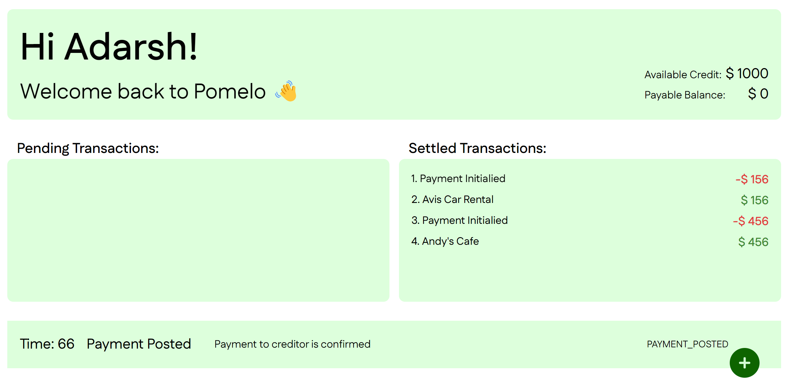

## Welcome to the Pomelo Web Application!

Hello Team Pomelo!

I have developed a web application that performs the following functions:

1. Reads a JSON object containing transaction data.
2. Simulates transactions based on predefined rules, updating state variables such as "Available Credit" and "Payable Amount."
3. Categorizes transactions as either "Pending" or "Settled."
4. Provides detailed explanations of each transaction in the section below.
5. I hope you find this project engaging and useful!

Tech Stack:

1. Typescript
2. Next.js
3. CSS
4. TSX

### Getting Started

To get started, please follow the steps below to set up the project environment:

#### Install Dependencies

Run the following command to install the necessary dependencies:

```bash
npm install
```

#### Start the Development Server

Launch the development server by running:

```bash
npm run dev
```

#### Access the Application

Open your browser and visit the following URL:

http://localhost:3000

I thoroughly enjoyed working on this exercise and am looking forward to your feedback. Hope to hear from you soon!

#### Preview:


